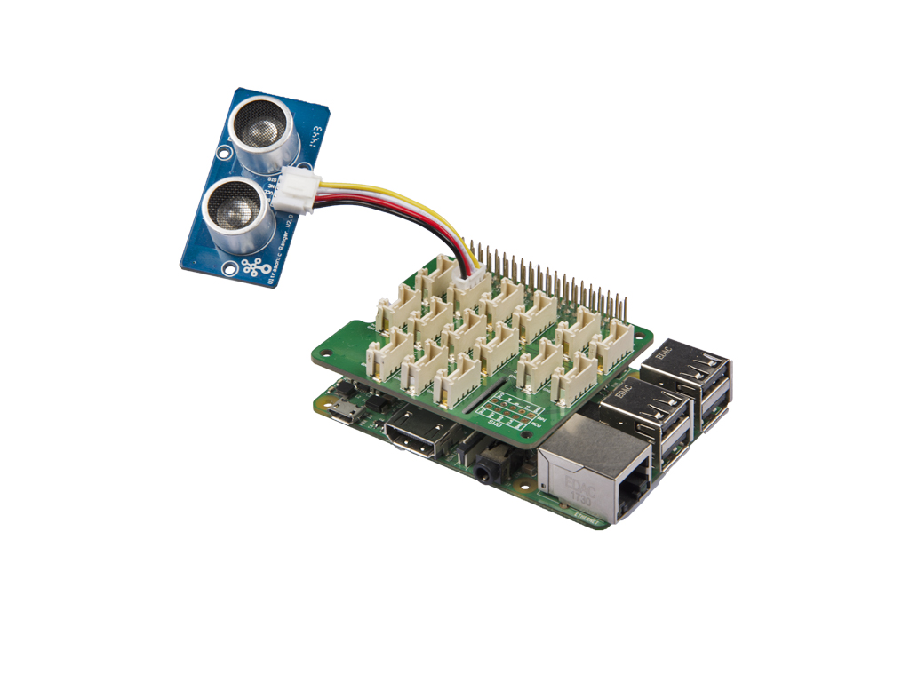

# Sistema reducción de riesgo de contagios aplicado al control de aforos

## DoorTempSense 

## Trabajo final IoT de Ivan Sanchez

 Este es el trabajo final para la asignatura Desarrollo de Aplicaciones para Internet de las Cosas, debido a motivos personales su funcionalidad se ha tenido que reducir ya que el tiempo ha sido escaso  y ha habido falta de recursos.

 Aun así, estas funcionalidades serán listadas e implementadas en  el futuro, ya que el proyecto es un módulo opcional (aunque independiente) a un proyecto en desarrollo.

### Descripción del problema

La pandemia de COVID-19 es una pandemia causada por por coronavirus cuyo afente principal es el virus SARS-CoV-2 la cual sigue estando activa a día de hoy (enero de 2021).

Uno de sus principales síntomas, y  en el que se va a centrar el proyecto es la fiebre, por lo tanto mediante un conglomerado de sensores, actuadores e HMIs (Human Machine Interface)

### Orientación del proyecto

Hay que tener en cuenta, que a día de hoy sigue sin existir un test 100% fiable del virus, y que muchos establecimientos públicos w están viendo obligados a reducir su aforo.

Viendo los síntomas, el único que parece objetivo y fácil de medir de manera no intrusiva es la temperatura corporal, verificar si el usuario tiene una temperatura elevada o no.

### Cómo funciona

Cuando una persona se aproxime a la puerta, será detectado  por el sensor infrarrojos  el cual ~~activará varios láseres y receptores IR~~  indicará con leds azules que la  persona  posicione su dedo en el sensor. Cuando la lectura se estabilice,  se considerará si tiene fiebre o no,  si la  tiene los  led  se  volverán rojos y el  buzzer sonará. Si no,cambiarán su color a verde. Antes de continuar el cliente/individuo  deberá pulsar el botón  que lleva  cuenta del aforo. A la salida deberá pulsarlo de nuevo,  actualizando el contador.

Además, como contamos con el DHT11 (temperatura & humedad) podemos tener una  clara visión del ambiente general del habitáculo,  pudiendo reducir el aforo si vemos que alguno de esos valores supera nuestros limites deseados.

### Cómo instalar DoorTempSense

1. Ejecutar *raspi-config* y habilitar las interfaces I2C, UART, GPIO y OneWire

2. Install needed packages

```bash
#Python deberia venir instalado en RPI OS, pero por lo menos para mi pip no estaba,  asi que instalmos por si acaso
sudo apt install python python3 python-pip python3-pip -y
curl -sL https://github.com/Seeed-Studio/grove.py/raw/master/install.sh | sudo bash -s
#Instalamos Apache y PHP par    a la interfaz web.+
sudo apt install apache2 php libapache2-mod-php -y
pip install Seeed_Python_DHT
```

### Estructura a nivel físico (instalación física)

El sistema consistiría de:

* ~~1 o múltiples (si queremos adaptarlo a  diferentes alturas: niños, adultos...) sensores de temperatura via infrarrojo~~
* ~~1 o múltiples Microcontroladores ESP8266 Wi-Fi para transmitir la información a una API central, alojada en nuestra Raspberry (cada uno puede leer varios sensores via I2C), reduciendo cableado y dificultad de instalación.~~
* ~~API REST Con interfaz web  para ver los datos recibidos por los ESP8266 en tiempo real~~
* Sensor  de  ultrasonidos
* Pulsador de entrada y de salida
* Sensor de humedad para comprobar que el habitáculo no  se está humedeciendo demasiado debido a la sobrecarga de visitantes.
* Buzzer para avisar
* Una Raspberry Pi, junto al *Grove hat (modulo para facilitar la conexión a sensores y actuadores mediante conectores JST-HX, en este caso 4s, ya que  dispoenmos  de cuatro pines de 2.5mm  [Grove Base Hat V1](https://wiki.seeedstudio.com/Grove_Base_Hat_for_Raspberry_Pi)* que se encargará de controlar todos los sensores, y mostrar en el puerto  1337 de su IP  el aforo actual y máximo.

### Raspberry Grove Base Hat


Detallado de las diferentes interfaces disponibles en el *Hat*

### Descripción funcional  de el software

En este caso, el proyecto consta de dos capas. Por una parte, está la capa física  (que se encargará de tanto sensores  como actuadores) y la capa servidor o cloud.

* Para la parte computacional, la controladora de sensores, etc usaremos Python que se ejecutará constantemente, es decir será un *daemon*.

* Por otro lado, con un servidor http (apache2) una interfaz web, la cual actualizará python.

Gracias a las librerías y la simplicidad de Python, se puede escribir la lógica del software rápidamente sin perder detalles respecto a lenguajes de más bajo nivel.

Si se quisiera añadir más complejidad a la web podríamos prescindir de apache2, con librerias como [Flask](https://flask.palletsprojects.com/en/1.1.x/) / [Django](https://www.djangoproject.com/). Como el prototipo no necesita tener opciones más avanzadas y solamente modificará los valores de un fichero CSV  (Comma separated)

### Componentes a utilizar

En su gran mayoría los componentes son de coste muy bajo, siendo la Raspberry Pi varias veces más cara que todo el resto junto para hacer un proyecto de tamaño pequeño-medio  5-10 puertas

* [~~Sensor de infrarojos MLX90614ESF~~](https://www.mouser.es/datasheet/2/734/MLX90614-Datasheet-Melexis-953298.pdf) No estará en el proyecto final, *pero era la idea principal*
* ~~Diodo emisor laser infrarrojo~~
* Raspberry Pi *Grove Base Hat* - [SEEDSTUDIO](https://wiki.seeedstudio.com/Grove_Base_Hat_for_Raspberry_Pi/#:~:text=The%20Grove%20Base%20Hat%20for%20Raspberry%20Pi%20provide%20Digital%2FAnalog,Hat%20for%20Raspberry%20Pi%20now.)
* Sensor de temperatura [DS18B20](https://www.mouser.es/datasheet/2/256/DS18B20-370043.pdf)
* Sensor de distancia por ultrasonidos *Detecta cuando alguien  hapasado la puerta y activa el láser*
* Raspberry Pi 3/4 (**En el futuro será sustituido por un microcontrolador de mucha menos potencia computacional, coste mucho menor y consumo casi nulo**)
* LEDs RGB (*Tira o diodos de 3 conexiones, el circuito variará dependiendo de la elección*)
* ~~Buzzer o altavoz de alerta~~ **Falta material, usaremos un LED para el prototipo**
* Pulsadores capacitivos (no es necesario hacer presión sobre ellos) y pulsadores estandar.
* Sensor de humedad [DHT11](https://www.alldatasheet.com/datasheet-pdf/pdf/1132088/ETC2/DHT11.html) o DHT22 (son iguales, cambia la resolución de cada uno)

## Demontración práctica

Como demostración, se construirá un prototipo simple, sin instalar, sólo una demo de funcionamiento. Ya que no disponemos del sensor de temperaatura IR tendremos que usar uno analógico tradicional, por lo que habrá que hacer contacto directo con él con nuestro cuerpo.

Sera una miniaturización o prueba de concepto.

## Librerías de  terceros

* [W1ThermSensor](https://pypi.org/project/w1thermsensor/)

    Librería para el sensor DS18B20 que implementa la interfaz 1-wire (una única conexión a los puertos GPIO, a diferencia  de SPI o I2C que requieren 2 o más)  e interpreta los datos recibidos por el sensor, para no tener que reinventar la rueda.

* [Grove Hat Library (todos los sensores menos el DS18B20 Y DHT11)](https://github.com/Seeed-Studio/grove.py)

* [seed_dht](https://github.com/Seeed-Studio/Seeed_Python_DHT)
